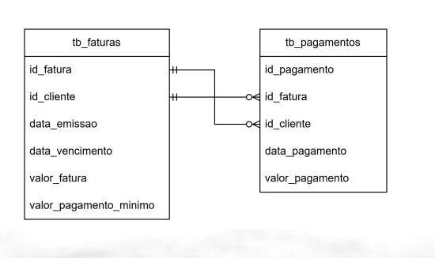
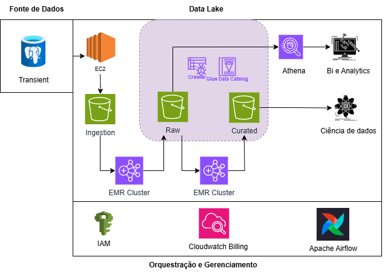
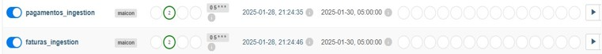
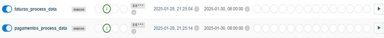
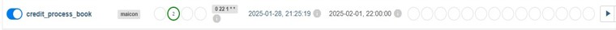

# **PoD Cartões - Projeto Data Lake**

## 📌**Introdução**
A PoD Cartões é uma empresa de cartões de crédito que busca otimizar o uso de seus dados, porém enfrenta desafios devido à fragmentação das informações em múltiplos sistemas lentos e a uma infraestrutura que não suporta Big Data. Essa limitação dificulta o consumo de dados organizados e de alta qualidade, prejudicando o desenvolvimento de modelos preditivos. Para solucionar esse problema, a empresa pretende implementar um Data Lake escalável e acessível, garantindo a unificação, governança e segurança dos dados. Além disso, será desenvolvido um Book de Variáveis para apoiar a criação de modelos analíticos mais eficazes.

A solução utiliza serviços da AWS para ingestão, processamento e organização de dados em zonas específicas (Raw, Trusted e Curated), além de orquestração de pipelines com o **Apache Airflow**.

## 📌**Dados**

## 📌**Arquitetura**
A arquitetura do projeto está ilustrada abaixo:

## 📌**Data Lake Zonas**

| **Zona**      | **Descrição**                                                                                                                                                                                                                                                                          |
|---------------|------------------------------------------------------------------------------------------------------------------------------------------------------------------------------------------------------------------------------------------------------------------------------------------|
| **Ingestion** | Dados brutos coletados diretamente do sistema transacional.                                                                                                                                                          |
| **Raw**       | Dados pré-processados que passaram por uma limpeza e validação iniciais, particionados por data e armazenados em formato Parquet. Uma tabela de controle é criada para registrar a data de processamento..                           |
| **Curated**   | Dados refinados, deduplicados e integrados, com enriquecimento por meio da criação de variáveis customizadas alinhadas aos requisitos do negócio. Essa camada inclui uma etapa pré-book (stage) para desenvolvimento de variáveis, seguida da agregação final conforme os períodos de análise e armazenamento na camada de Book para análises avançadas e modelagem preditiva. |
                                                                                                                
                                                                                                                
                                                                                                                
## 📌**Serviços Utilizados**

| **Serviço**         | **Descrição**                                                                                                                                                      |
|---------------------|---------------------------------------------------------------------------------------------------------------------------------------------------------------------|
| **EC2**  |  Instância utilizada para executar o Apache Airflow em um ambiente Docker e a ingestão dos dados.                        |
| **Apache Airflow**  | Orquestração de pipelines de ingestão e transformação de dados, permitindo o agendamento, monitoramento e automação dos fluxos de trabalho.                        |
| **EMR**             | Plataforma gerenciada de Big Data que faz a execução dos processos ETL e análises distribuídas, utilizando Spark                   |
| **Glue**            | Serviço para catalogação que automatiza a descoberta dos dados armazenados no S3 para consulta e análise.                             |
| **Athena**          | Serviço de consulta interativa que permite executar queries SQL diretamente sobre os dados armazenados no S3, facilitando análises ad hoc e geração de relatórios. |
| **S3**              | Armazenamento escalável e durável que hospeda as zonas Raw, Trusted e Curated do Data Lake.                                                                         |
| **IAM**             | Gerenciamento de identidades e acessos que assegura controles de segurança e permissões adequadas aos recursos AWS.                                                   |
| **CloudWatch**      | Serviço de monitoramento que coleta métricas e logs da infraestrutura AWS, contribuindo para o controle de custos e desempenho.                                      |
| **Docker**          | Plataforma de contêinerização que facilita a criação, implantação e execução de aplicações em ambientes isolados e consistentes, otimizando o desenvolvimento e a integração. |

## 📌**Bibliotecas**

- pandas
- pyspark
- datetime
- time
- boto3
- configparser
- os

## 📌**DAGS**
🔹 **Todas as Dags são programadas para enviar um e-mail em caso de falha nos processos.**

### **Ingestão**
- Responsável pela extração de dados do SGBD e armazenamento na primeira camada do Data Lake (Ingestion).
- A DAG é programada para executar diariamente às 05:00h, garantindo que os dados mais recentes sejam transferidos para o Data Lake.
  

  

### **Processamento de dados por tabela**
- Esta DAG inicia um cluster EMR que executa um step job para realizar o processamento dos dados por assunto (tabelas individuais).
- Após o processamento, o cluster é finalizado automaticamente para evitar custos adicionais.
- Programada para executar diariamente às 08:00h, mantendo os dados processados atualizados.
  

### **Processamento de Book**
- Focada na criação e atualização das tabelas stage e book de variáveis, essenciais para análises e modelos preditivos.
- A DAG sobe um cluster EMR, executa o step job e encerra o cluster ao final do processamento.
- Programada para rodar mensalmente, todo dia 01, às 22:00h, garantindo que os dados do book estejam preparados para análises estratégicas.
  

## 📌**BOOK DE VARIÁVEIS**

###  **STAGE**
Na etapa **Stage**, foram criadas variáveis para analisar o comportamento de uso do cartão de crédito pelos clientes. As principais métricas incluem:  

- **Classificação de Dias de Atraso**  
- **Número de Dias em Atraso**  
- **Classificação do Valor Pago em Relação à Fatura**  
- **Porcentagem da Fatura Paga**  
- **Quantidade de Transações**  

---

### **BOOK**  
Na etapa **Book**, os valores numéricos foram agregados por classificação e janelas de tempo, utilizando **01/02/2024** como data de referência.  
A análise segue uma visão mensal para os períodos:  
**U1M, U3M, U6M, U9M e U12M** (últimos 1, 3, 6, 9 e 12 meses).  

Ao todo, foram geradas **665 variáveis agregadas**, organizadas conforme as seguintes categorias:  

---

## 🔹 1. Classificação por Prazo de Pagamento (`fbc_classificacao_dias_pagamento`)  
Define o status do pagamento com base na data de vencimento:  

- `SEM_PAGAMENTO` → Nenhum pagamento registrado  
- `PAGAMENTO_ATRASADO` → Pago após o vencimento  
- `PAGAMENTO_NO_PRAZO` → Pago exatamente no vencimento  
- `PAGAMENTO_ANTECIPADO` → Pago antes do vencimento  

## 🔹 2. Classificação por Valor Pago (`fbc_classificacao_vlr_pagamento`)  
Agrupa os pagamentos conforme a proporção do valor pago em relação ao total da fatura:  

- `PAGAMENTO_INSUFICIENTE` → Pagamento menor que o mínimo exigido  
- `PAGAMENTO_MINIMO` → Pagamento exatamente no valor mínimo  
- `PAGAMENTO_TOTAL` → Pagamento integral da fatura  
- `PAGAMENTO_PARCIAL` → Pagamento maior que o mínimo, mas menor que o total  

## 🔹 3. Indicadores Financeiros Calculados (`fvls`)  
Cada métrica de pagamento é analisada a partir das seguintes variáveis:  

- 📌 **`fvl_valor_fatura`** → Valor total da fatura  
- 📌 **`fvl_valor_pagamento_minimo`** → Valor mínimo exigido  
- 📌 **`fvl_valor_pagamento`** → Valor efetivamente pago  
- 📌 **`fvl_numero_dias_atraso`** → Número de dias em atraso  
- 📌 **`fvl_qtd_transacao`** → Quantidade de transações realizadas  
- 📌 **`fvl_pct_fatura_pgto`** → Percentual da fatura que foi paga  

## 🔹 4. Janelas Temporais (`janelas`)  
As métricas são analisadas dentro das seguintes janelas de tempo:  

- 🕒 **Último mês (`flg_u1m`)**  
- 🕒 **Últimos 3 meses (`flg_u3m`)**  
- 🕒 **Últimos 6 meses (`flg_u6m`)**  
- 🕒 **Últimos 9 meses (`flg_u9m`)**  
- 🕒 **Últimos 12 meses (`flg_u12m`)**  

## 🔹 5. Métricas Agregadas (`aggs`)  
Para cada variável financeira e janela temporal, são aplicadas as seguintes funções estatísticas:  

- **`SUM`** → Soma dos valores no período  
- **`AVG`** → Média dos valores no período  
- **`MAX`** → Valor máximo no período  
- **`MIN`** → Valor mínimo no período  

---

## 🔹 6. Regras de Exclusão de Métricas  
Para garantir a coerência dos cálculos, algumas combinações de métricas foram desconsideradas:  

❌ **`fvl_numero_dias_atraso`** → Não faz sentido somar dias de atraso ao longo dos meses.  

❌ **`fvl_qtd_transacao`** → Só pode ser somado, pois cada transação é contabilizada individualmente por mês.  

❌ **`fvl_pct_fatura_pgto`** → Não faz sentido somar percentuais de fatura paga ao longo dos meses.  

❌ **`flg_u1m`** → Permite apenas soma (`SUM`), pois em um único mês, as funções `SUM`, `AVG`, `MAX` e `MIN` retornariam o mesmo valor.  

❌ **`SEM_PAGAMENTO` e `PAGAMENTO_TOTAL`** → Não possuem métricas de percentual pago, pois resultariam em colunas constantes.  

---
